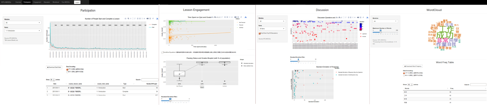

# NTU MOOCs X Coursera Data Analytics
* Aims at deriving insights from NTU MOOCs X Coursera data 
* Use shiny R as an interactive website framwork
* Provide Overview, Participation, Engagement, Discussion and Wordcloud sections
* Retrieve Course Data from Coursera Data Export API
<br><br>
<!---->

## Table of Content
* [Environment](#environment)
* [R packages](#r-packages)
* [Setup - Ubuntu on VMWare Workstation 12 Player](#setup---ubuntu-on-vmware-workstation-12-player)
* [Setup - Shiny Serevr on Ubuntu 12.04 or later](#setup---shiny-serevr-on-ubuntu-12.04-or-later)
* [Setup - R packages](#setup---r-packages)
* [Coursera Data Export API](#coursera-data-export-api)
* [Clickstream Data Guide](#clickstream-data-guide)

## Environment
* R-3.3.2
* [Shiny-Server-1.5.1.834](https://www.rstudio.com/products/shiny/download-server/)
* Java-OpenSDK-7
* Ubuntu-14.04
* VMWare-Workstation-Player-12 

## R packages
* [Shiny](https://shiny.rstudio.com/)
 	+ shiny, shinyjs 
* Data Manipulation
	+ dplyr, DT, reshape, RMySQL
* Plot
	+ circlize, lattice, ggplot2, plotly, scales
* Word Processing
	+ rJava, RColorBrewer, Rwordseg, tm, tmcn, wordcloud

## Setup - Ubuntu on VMWare Workstation 12 Player
* VMWare Workstation 12 Player
	+ Download [VMNETCFG.EXE](https://ninety9names.wordpress.com/2013/12/18/download-vmnetcfg-exe-vmnetcfglib-dll-for-vmware-player-6-x-7-x/comment-page-1/#comment-17) for Virtual Network Editor of VMWare Workstation 12 Player
	+ Edit NAT setting
		+ Open Virtual Network Editor
		+ Add Port Forwarding
			+ Host port
			+ Virtual machine IP and port of the service (__:3838__ for shiny-server)
	+ Set intbound rule for the service port (__:3838__ for shiny-server) on the host's firewall
* xRDP-Ubuntu-Mate-Desktop [[1](http://expertisenpuru.com/how-to-fix-grey-screen-with-x-cursor-problem-in-ubuntu-14-04-or-higher/)]
	+ Install xRDP-Ubuntu-Mate-Desktop
	```
	$ apt-get install xrdp
	$ apt-add-repository ppa:ubuntu-mate-dev/ppa
	$ apt-add-repository ppa:ubuntu-mate-dev/trusty-mate
	$ apt-get update
	$ # apt-get upgrade
	$ apt-get install ubuntu-mate-core ubuntu-mate-desktop
	$ mate-session >~/.xsession
	$ service xrdp restart
	```
	+ Edit NAT setting for Remote Control
		+ Open Virtual Network Editor
		+ Add Port Forwarding
			+ Host port (e.g. __:3390__)
			+ Virtual machine IP and rdp port (e.g. __:3389__ default)
	+ Set inbound rule for the rdp port (__:3390__) on the host's firewall

	
## Setup - Shiny Serevr on Ubuntu 12.04 or later
* Download Shiny Server [[1](https://www.rstudio.com/products/shiny/download-server/)]
```
$ sudo apt-get install r-base
$ sudo su - \ -c "R -e \"install.packages('shiny', repos='https://cran.rstudio.com/')\""
$ sudo apt-get install gdebi-core```
$ wget https://download3.rstudio.org/ubuntu-12.04/x86_64/shiny-server-1.5.1.834-amd64.deb
$ sudo gdebi shiny-server-1.5.1.834-amd64.deb
```
* Update R version [[1](https://www.digitalocean.com/community/tutorials/how-to-set-up-r-on-ubuntu-14-04)]
```
$ sudo sh -c 'echo "deb http://cran.rstudio.com/bin/linux/ubuntu trusty/" >> /etc/apt/sources.list'
$ gpg --keyserver keyserver.ubuntu.com --recv-key E084DAB9
$ gpg -a --export E084DAB9 | sudo apt-key add -
$ sudo apt-get update
$ sudo apt-get -y install r-base
```
* Application
	+ __/srv/shiny-server/__
	+ __/srv/shiny-server/server.R__ and __/srv/shiny-server/ui.R__ (__index.html__) are required
	+ In __server.R__, the way to initiate shiny-server is ``` shinyServer(function(input, output, session){ ... }) ```
	+ If there is ``` renderPlot({ ... }) ``` or ``` renderPlotly({ ... }) ``` plot output in the application then put ``` pdf(NULL) ``` [[1](https://github.com/ropensci/plotly/issues/494)] in the top of the code
* Configuration 
	+ __/etc/shiny-server/shiny-server.conf__
	``` 	
	run_as shiny;
	server {
		listen 3838;
		location /app-moocs {
		    site_dir /srv/shiny-server/app-moocs;
		    log_dir /var/log/shiny-server/app-moocs;
		    directory_index on;
		}
	}
	```
## Setup - R packages
* Most of the packages can be installed through R command ``` install.packages("package_name") ```  (or install from source)
	+ tmcn
	``` 
	install.packages("tmcn", repos="http://R-Forge.R-project.org") 
	```
	+ Rwordseg
	``` 
	install.packages("Rwordseg", repos="http://R-Forge.R-project.org")
	```
* However, some of the packages have dependency problems, so run terminal command before R command
	+ plotly [[1](http://unix.stackexchange.com/questions/320594/how-to-install-r-plotly-in-debian)]
	```
	$ apt-get install libssl-dev
	$ apt-get install libcurl4-openssl-dev
	$ R
	> install.packages("plotly")
	```
	+ rJava [[1](http://stackoverflow.com/questions/34212378/installation-of-rjava)] [[2](http://stackoverflow.com/questions/26797428/failing-to-install-rjava-package-in-r-with-error-bootstrap-class-path-not-set-i)]
	```
	$ apt-get install openjdk-7-jdk
	$ R CMD javareconf
	$ reboot
	$ apt-get install liblzma-dev
	$ R
	> install.packages("rJava")
	```
	+ RMySQL [[1](http://blogs.candoerz.com/question/269278/error-installing-rmysql-mysql-5537-in-ubuntu-1404-.aspx)] [[2](http://stats.stackexchange.com/questions/194515/r-package-rmysql-installation-returns-a-configuration-failed-error)]
	```
	$ apt-get install libmysql++-dev
	$ apt-get install libmysqlclient-dev
	$ apt-get install r-cran-rmysql
	$ R
	> install.packages("RMySQL")
	```
	<br>
## Coursera Data Export API
* More info on [courseraresearchexports](https://github.com/coursera/courseraresearchexports) gitbub
* More info regarding to process automation on [Coursera-scheduled-exports](https://github.com/LU-C4i/coursera-scheduled-exports) gitbub
* Only the data retrieved using __Data Coordinator__ account will the hased __user_id__ be a cross-domain identifier to identify the same user across the multiple table domains Otherwise, without the Data Coordinator role, each table domain uses a separate user ID to distinguish between the different types of learner-generated data
* Install python 2.7 distribution of Anaconda [[1](https://www.continuum.io/downloads)]
```
$ bash ~/Anaconda2-4.4.0-Linux-x86_64.sh
```
* Install python packages for coursera data export
```
$ pip install courseraresearchexports
$ pip install autocomplete
$ activate-global-python-argcomplete
$ pip install courseraoauth2client
```
* Create an application at https://accounts.coursera.org/console (seems only available on non-Windows OS) using a valid Coursera partner account (better to be the __data coordinator account__ to grant more priviledges), and set the Redirect URI to be http://localhost:9876/callback on the console. Get __client id__ and __secret__ for app auth later (Notice that the app name created on the console does not matter. The scope of the app is only view_profile, and has no use due to some errors in client authentication).
* Authorize the application: __manage_research_exports__ (just use this name, no need to create it on the Coursera dev console). You will be required to authenticate and login to a valid Coursera partner account. Notice that only the __data coordinator account__ can request __clickstream__ data.
```
$ courseraoauth2client config authorize --app manage_research_exports
```
* Request course data (clickstream data not included), e.g. mechanics-of-materials-1
```
$ courseraresearchexports jobs request tables --course_slug mechanics-of-materials-1 --purpose "mechanics-of-materials-1 course data"
```
* Request clickstream data (interval is optional), e.g. mechanics-of-materials-1
```
$ courseraresearchexports jobs request clickstream --course_slug mechanics-of-materials-1 --purpose "mechanics-of-materials-1 clickstream data" \--interval 2017-01-01 2017-07-01
```
* View all requested jobs
```
$ courseraresearchexports jobs get_all
```
* Download jobs by request id (csv files)
```
$ courseraresearchexports jobs download $EXPORT_REQUEST_ID
```
* Containers: Creates a docker container using the postgres image and loads export data into a postgres database on the container (postgres SQL is included in a docker). To create a docker container from an export, first request an export using the jobs command. Then, using the $EXPORT_REQUEST_ID.
	+ Install Docker CE [[1](https://docs.docker.com/engine/installation/linux/docker-ce/ubuntu/#os-requirements)]
	+ List containers
	```
	$ courseraresearchexports containers list
	```
	+ Create container for the data of a request id
	```
	$ courseraresearchexports containers create --export_request_id ilxqhxfr6s
	```
	+ Start/stop/remove a container by the container id
	```
	$ courseraresearchexports containers start 8f53f165f415 
	```
	+ Connect the container id, and your are allowed to query by SQL
	```
	$ courseraresearchexports db connect 8f53f165f415
	DBName> select * from table;
	```
	+ Create view
	```
	$ courseraresearchexports db create_view 8f53f165f415 --view_name demographic_survey
	```
	+ Create view by SQL file
	```
	$ courseraresearchexports db create_view $CONTAINER_NAME --sql_file /path/to/sql/file/new_view.sql
	``` 
	+ List_tables
	```
	$ courseraresearchexports db list_tables $CONTAINER_NAME
	``` 
	+ List_views
	```
	$ courseraresearchexports db list_views $CONTAINER_NAME
	```
	+ unload_to_csv
	```
	$ courseraresearchexports db unload_to_csv $CONTAINER_NAME --relation demographic_survey --dest /path/to/dest/
	```
## Clickstream Data Guide
* More info on [Clickstream Data Guide](https://coursera.gitbooks.io/data-exports/content/clickstream_data_guide/) gitbook
* Clickstream data (Data exports do not provide clickstream data for Coursera's iOS and Android application)
	+ Video: Interactions with lecture videos (e.g start, stop, pause, change subtitles, heartbeats)
	+ Access: Accessing course description page, course material, and anything else under the url https://coursera.org/learn/YOUR_COURSE_SLUG
* Metadata Fields
	+ [partner]_user_id
		+ A hashed id that may identify the same user across multiple table domains
	+ hashed_session_cookie_id
	+ server_timestamp
	+ hashed_ip
	+ user_agent
	+ url
	+ initial_referrer_url
		+ The url whence the user first navigated to your course. The url must be from a non-Coursera domain, and the initial referrer is refreshed after 30 minutes of inactivity. E.g. https://www.google.com/
	+ browser_language
	+ course_id
	+ country_cd
	+ region_cd
		+ An alphanumeric string up to three letters (second part of ISO 3166-2) denoting a country subdivision dervied from the ip using the [Maxmind GeoIP2 database](https://www.maxmind.com/en/geoip2-city)
	+ timezone
	+ os
	+ browser
The following SQL can create a table in postgres that is then suitable to have clickstream data copied into:
```
CREATE TABLE clickstream_events (
    hashed_user_id varchar,
    hashed_session_cookie_id varchar,
    server_timestamp timestamp,
    hashed_ip varchar,
    user_agent varchar,
    url varchar,
    initial_referrer_url varchar,
    browser_language varchar,
    course_id varchar,
    country_cd varchar,
    region_cd varchar,
    timezone varchar,
    os varchar,
    browser varchar,
    key varchar,
    value varchar
);
```
* Video Data Fields
	+ heartbeat
		+ An event that is fired every 5 seconds of the video playing
		+ The value JSON object contains the following additional fields: ~~playback_rate, subtitle_language, tech (html5 or flash), volume, module_id, timecode, video_name~~
	+ wait
		+ An event fired when the user requires to wait to buffer additional video. (For example, due to slow internet)
		+ The value JSON object contains the following additional fields: ~~module_id, timecode, video_name~~

	+ seek
		+ An event fired when the user seeks to another part of the video. The timecode field in this event refers to the time the user is seeking to
		+ The value JSON object contains the following additional fields: ~~module_id, timecode, video_name~~
	+ start
		+ An event fired when the video first starts. The `timecode` field should be 0
		+ The value JSON object contains the following additional fields: ~~module_id, timecode, video_name~~
	+ end
		+ An event fired when the video ends. The `timecode` field should be close to the length of the video
		+ The value JSON object contains the following additional fields: ~~module_id, timecode, video_name~~
	+ pause
		+ An event fired when the user pauses the video
		+ The value JSON object contains the following additional fields: ~~module_id, timecode, video_name~~
	+ play
		+ An event fired when the user restarts a paused video
		+ The value JSON object contains the following additional fields: ~~module_id, timecode, video_name~~
		
	+ volume_change
		+ An event fired when the user changes the volume
		+ The value JSON object contains the following additional fields: ~~playback_rate, subtitle_language, tech, volume, volume_delta, module_id, timecode, video_name~~
	+ subtitle_change
	+ playback_rate_change
		+ An event fired when the user changes the playback rate
		+ The value JSON object contains the following additional fields: ~~playback_rate, playback_rate_delta, subtitle_language, tech, volume, module_id, timecode, video_name~~
	+ download_subtitle
		+ An event fired when the user clicks the download subtitle button
		+ The value JSON object contains the following additional fields: ~~language_code~~
	+ download_video
		+ An event fired when the user clicks the download video button
* Access Data Fields
	+ pageview
		+ This event is fired when a user accesses Coursera's website through a browser. The browser may be a desktop browser (e.g Chrome), or a mobile browser (e.g Chrome Mobile). More specifically, the event is fired when the user downloads all the Javascript required to render the page. If a user hits coursera.org but then closes the browser, or goes to another page before all the Javascript is downloaded, that user will not trigger a ~~pageview~~ event
	+ page_requested: This event is fired when a user makes a request to Coursera's website through a browser
		+ This event is fired when a user makes a request to Coursera's website through a browser. This differs from the pageview event in that it is fired immediately after the user requests the page, not when the user downloads the HTML for rendering the page. This event is not fired when the user navigates within a single page application. There should be less ~~page_requested~~ events than ~~pageview~~ events
	+ page_preloaded
		+ This event is fired the first time the user downloads Coursera's Javascript for a given page load. This differs from the pageview event in that it is fired before all the Javascript required to render the page is downloaded. This event is not fired when the user navigates within a single page application. There should be less ```page_preloaded```events than ```pageview``` events
	+ Access Type: home
		+ lecture
		+ supplement
		+ peer
		+ exam
		+ discussions
		+ outline
		+ quiz
		+ module
		+ programming
		+ forum
		+ discussionPrompt
		+ gradedLti
		+ resources
		+ ungradedLti
		
