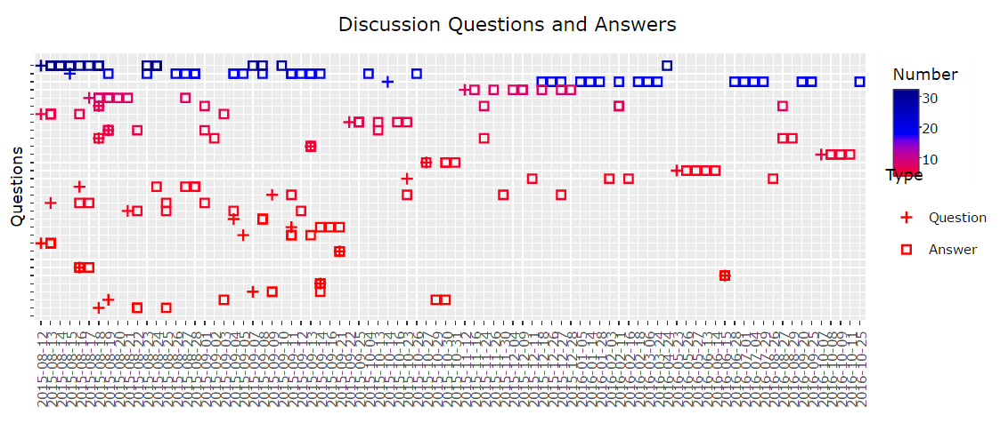
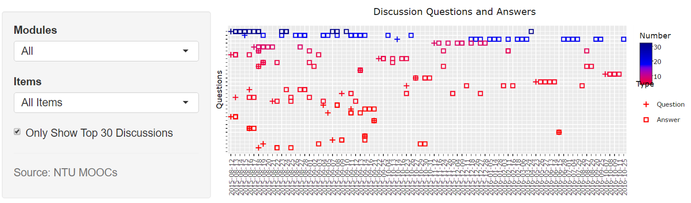
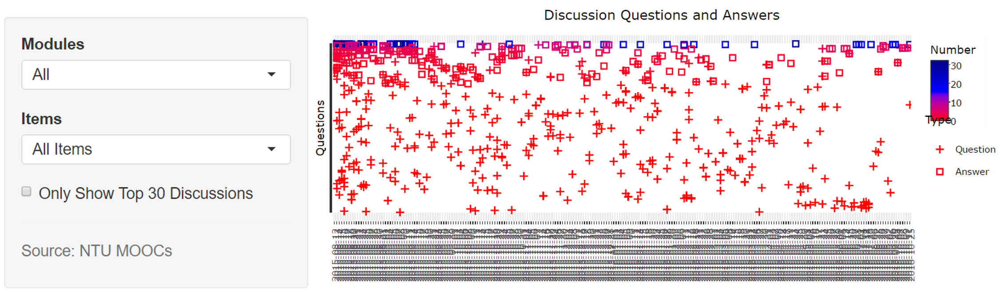
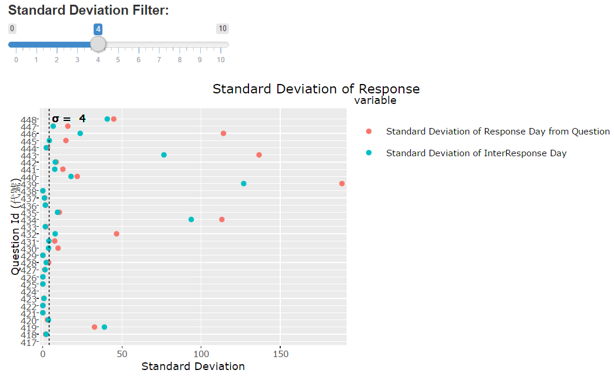
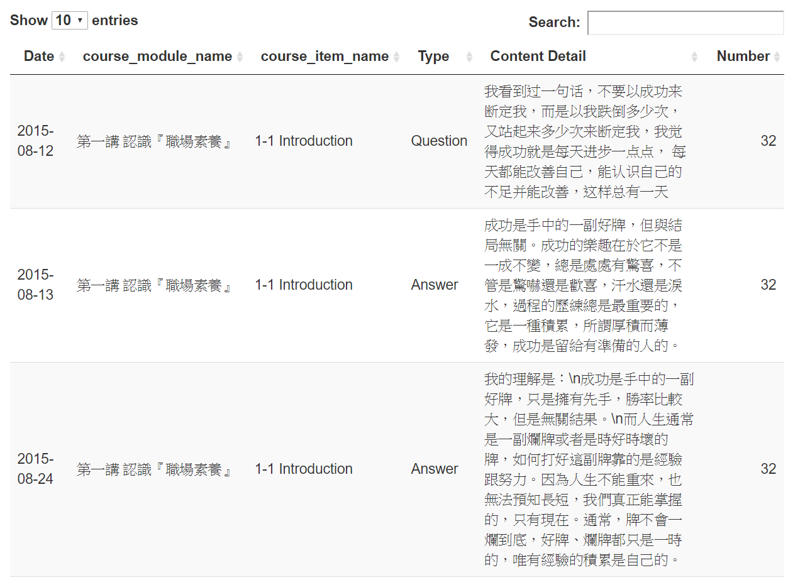

# 
Discussion 論壇回饋頁面簡介

## __主要功能__

* 呈現討論區的問題與回答數的關係
* 互動式圖表

 

## __討論區資料分析__
  
### __1. Discussion Question and Answers__
* 圖表簡介
  + 每一行代表一個問題與他接續產生的回答
  + 「+」代表問題，而「□」代表回答
  + 每個「+」或是「□」皆可對應到下面的的時間軸
  + 藉由看問題被回答了多少次（多少個「□」），可以了解問題在學生之間的共鳴性
  + 藉由看問題與回答之間的間隔，可以了解問題對於學生的急迫性與重要性
  + 縱軸代表著題目的題號，會與某題目一對一對應
         

* Only Show Top 30 Discussions
  + 某些課程的超過 30 筆，為了讓圖表更方便檢閱，提供「Only Show Top 30 Discussions」的選項  
  + 下圖顯示有勾選與沒有勾選的差異
     
     
     
     
  
### __2. 回應時間與問題距離天數的標準差表__
* 圖表簡介
  + 顯示每個問題回答時間天數的標準差
  + 老師可以藉此知道各個問題被回答的離散程度
  + 如果離散程度很大，表示此問題的討論時程很分散
  + 如果某問題沒有回答或是被回答一次，他的標準差為零
  
* 標準差拉條
  + 拉條上面的數值為圖表中虛線橫軸的數值
  + 藉由調整拉條可以改變圖表中的虛線
  + 此功能可以幫助使用者更加方便比較
       
  
### __3. 資料下載__ 
* 圖表下方提供 csv 檔的資料下載
  + utf8 大多為 Mac OS 作業系統所使用 
  + big5 的下載格式大多為 Windows 作業系統所使用 
  + 如果不太清楚建議兩種格式都下載，開啟沒有亂碼的為適用的格式
       

### __4. 資料搜索__ 
* 使用者可以利用關鍵字搜尋自己所需的詳細資料
      

