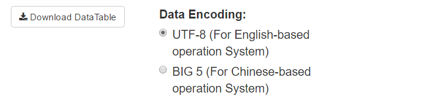

# 
Engagement 學習成績頁面簡介

## __主要功能__

* 提供學生修課成績與投入寫作業時間的關係
* 提供趨勢線，表現學生投入程度的線性走勢，判別變數(學習時間)與應變數(成績)之間是正相關(正斜率)或是負相關(負斜率)
* 互動式圖表

 

## __所花時間與成績資料分析__
  
### __1. 成績資料分析__
* 圖表簡介
  + 橘色的點「Not passed」 為不通過
  + 藍色的點「Passed」 為通過
  + 綠色的點「Verified」 為認證通過
  + 橘色的線為「Not passed」的各個點所畫出的回歸線，代表所有「Not passed」的點歸納出成績與所花時間的關係
  + 藍色的線為「Passed」的各個點所畫出的回歸線，代表所有「Passed」的點歸納出成績與所花時間的關係 
  + 綠色的線為「Verified」的各個點所畫出的回歸線，代表所有「Verified」的點歸納出成績與所花時間的關係
  + 藉由成績資料分析的圖，老師可以了解學員在作業上所花的時間與成績的關係
      

* 課程項目選單
  + 第一個選單為「Module」，乃每星期老師開課的主題
  + 第二個選攤為「Item」，乃每星期老師開課主題裡面的子項目 
  因為 Engagement 頁面主要為了解學生修課成績與投入課程時間的關係，裡面只有「Graded Assessment」與「Assessment」的兩種分類
       

* 圖表互動細節
  + 將滑鼠滑到圖表中的點，可以看到更多的細項
        

* 回歸公式顯現
  + 點擊「Trendline Equations」，可以看到回歸公式的數值與決定係數
    
  

* 盒鬚圖
  + 顯示「通過」、「不通過」、「認證通過」的學生的成績分散情況
  + 顯示出每種型態的最大值、最小值、中位數、下四分位數及上四分位數
        

### __2. 國籍與成績 Demographics and Grades Boxplot__

* 顯示學生來自不同國籍的成績分散情況
       

### __3. 語言與成績 Language and Grades Boxplot__

* 顯示學生使用不同語言的成績分散情況
      

### __4. 資料下載__ 
* 圖表下方提供 csv 檔的資料下載
  + utf8 的下載格式大多為 Mac OS 作業系統所使用 
  + big5 的下載格式大多為 Windows 作業系統所使用 
  + 如果不太清楚建議兩種格式都下載，開啟沒有亂碼的為適用的格式
       

### __5. 資料搜索__ 
* 使用者可以利用關鍵字搜尋自己所需的詳細資料
       

