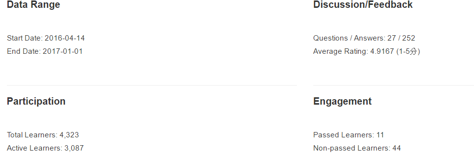
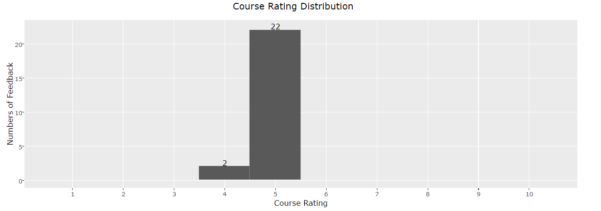
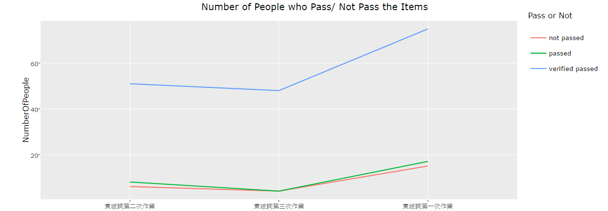
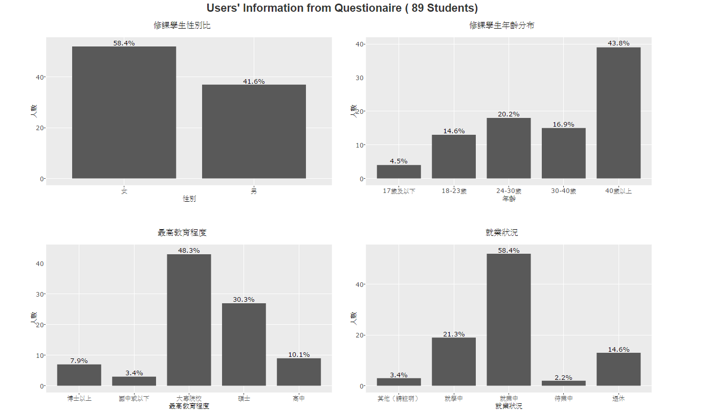
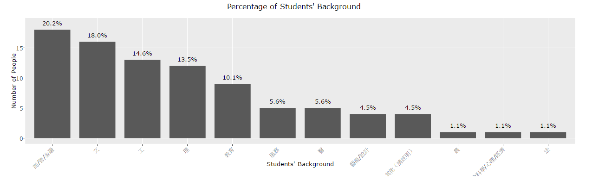
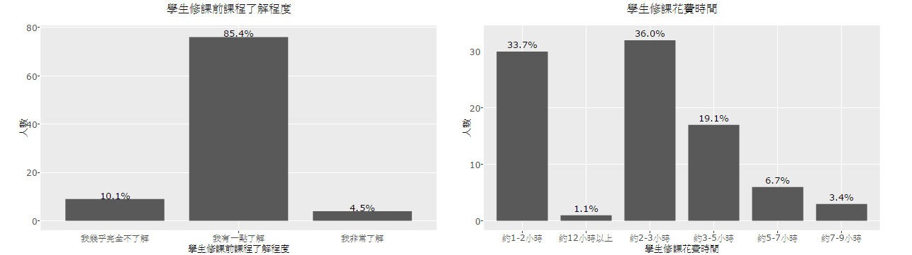
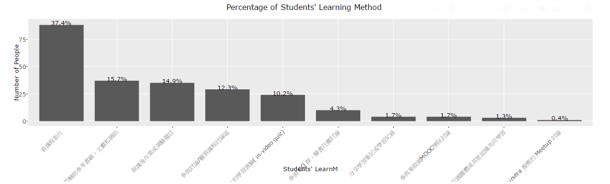
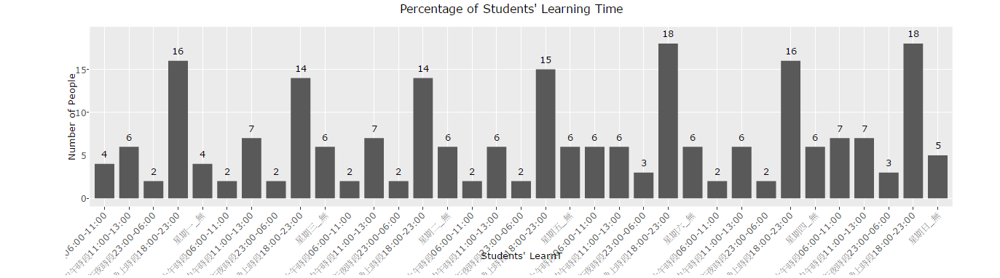

# 
Overview 總覽頁面簡介

## __主要功能__

* 提供課程的基本資料（如：開課時間、結束時間等）
* 提供學生的基本資料（來自課後的問卷)

  

## __課程基本資料__
 
### __1. 課程基本資料__ 

* 資料範圍
  + 開課時間、閉課時間
* 論壇回饋
  + 討論與其回應個數
     為課程全部討論與其回答加總的總數
  + 回饋的評價分數
     學員對此堂課評價的平均，滿分為 5 分
* 參與人數
  + 學生總數
     有註冊此門課的學生總數
  + 活躍學生總數
     有在此門課觀賞影片、寫作業、問問題的學員總數
* 學習成績
  + 通過學生總數
  + 未通過學生總數
     有在此門課觀賞影片、寫作業、問問題的學員總數

### __2. 評分回饋__
* 了解課堂評分 1-5 的分數各有多少學生評價
* 藉此圖表可以了解課程
  + 評價分數平均的來源 
   例如：評價為 4 分有可能是很多 5 分與一些 1 分或是全部都是 4 分而來
  
 

### __3. 通過項目__
* 了解課程中各個項目的通過、未通過與認證通過的學生的數量與比例
* 藉此圖表可以了解課程各項目的
  + 熱門度
     例如：很多 / 很少比例的人參與作答
  + 難易度
     例如：很大 / 很少比例的人通過課程
    
  
      

## __學員的基本資料（來自課後的問卷）__

### __1. 學生背景__
* 此資料來源為自行設計的問卷，括號後面為問卷填寫人數
* 修課學生性別比、年齡分布、最高教育程度、就業情況
  + 了解此課程修課學員的特徵
  + 可針對課程吸引到的學員設計未來課程
  
  

* 修課學生背景
  + 可了解學員原本的學習範疇為理工、教育、商科等
  + 可以針對不同的學員設計未來課程 
  
  

### __2. 問卷題目__
* 學員修課前的了解程度、學員修課花費的時間
  + 了解學員原本的程度與願意花費的時間來最佳化課程影片與作業設計
  
  

* 學員修課的學習方法
  + 了解學員最注重在使用平台的哪種學習工具（影片）
  + 了解課程設計可以著重在哪種學習工具
  
  

* 學員修課的學習時間
  + 了解學員平時最常在哪個時段學習
  
  
