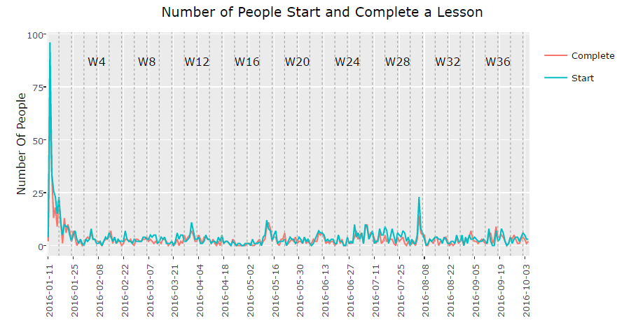
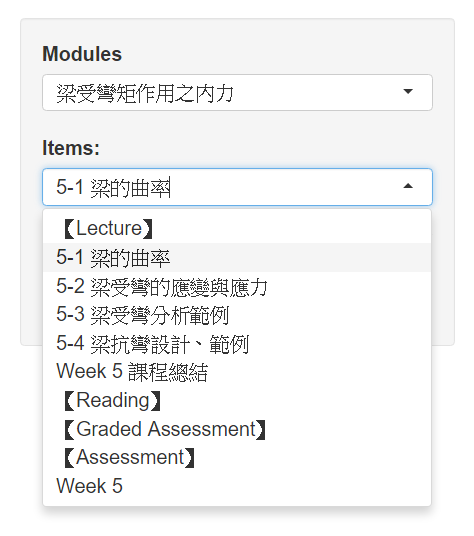
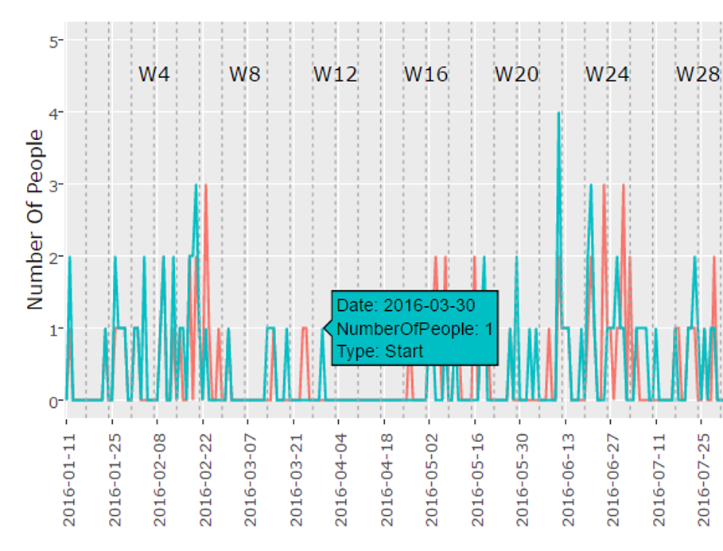
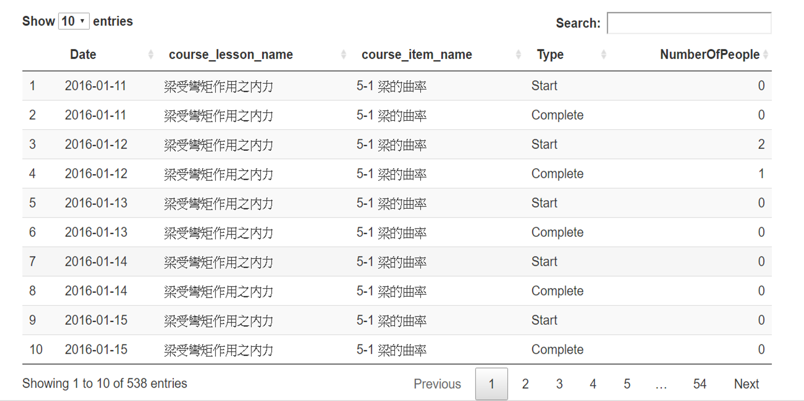

# 
Participation 參與狀況頁面簡介

## __主要功能__

* 每日開始上課和結束上課的人數變化
* 互動式圖表

  

## __學員的課程參與度__

### __1. 課程參與互動圖表__ 
* 圖表簡介
  + 綠線為「開始」使用課程
  + 紅線為「完成」課程
  + 藉此圖表可以了解此課程在不同時間觀賞的人數
  + 藉此圖表可以了解此課程在不同時間有多少人「開始」但沒有「完成」
  + 老師們藉此可以比對不同課程隨著時間變化的熱門程度
        

* 課程項目選單
  + 第一個選單為「Module」，乃每星期老師開課的主題
  + 第二個選攤為「Item」，乃每星期老師開課主題裡面的子項目 
  「Item」有「Lecture」、「Reading」、「Graded Assessment」、「Assessment」的分類
          

* 圖表互動細節
  + 將滑鼠滑到圖表中的點，可以看到更多的細項
        

### __2. 資料下載__ 
* 圖表下方提供 csv 檔的資料下載
  + utf8 大多為 Mac OS 作業系統所使用 
  + big5 的下載格式大多為 Windows 作業系統所使用 
  + 如果不太清楚建議兩種格式都下載，開啟沒有亂碼的為適用的格式
        

### __3. 資料搜索__ 
* 使用者可以利用關鍵字搜尋自己所需的詳細資料
       
