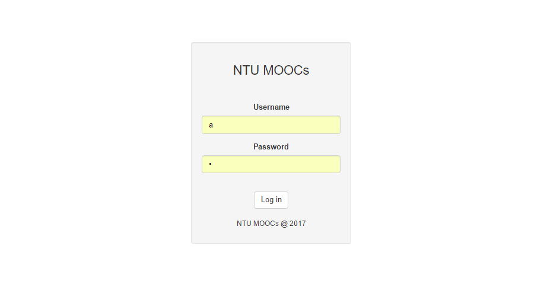
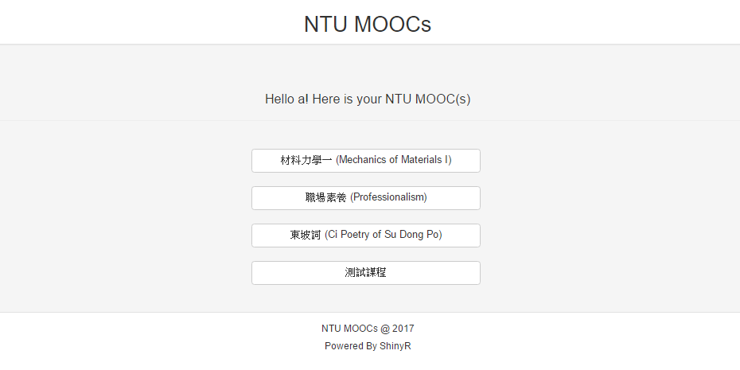
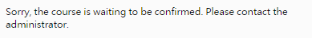
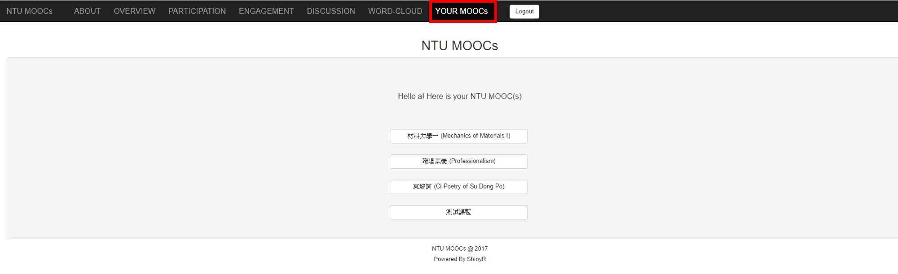

# 
 NTU MOOCs 資料分析平台

## __主要功能__
* 將學生線上學習行為以互動式圖表呈現
* 將學生提問與反饋以互動式圖表呈現

  

<!---## __進入平台課程__

1. 輸入平台網址後，請登入平台 

  
  

2. 選擇自己想要查看的課程 

  

如果有課程正在等待管理員的核准，將會出現「課程正在等待管理員核准」的字樣。

  

-->
## __平台資料分析__

1. Overview
      * 提供課程基本資料（如，開課時間、結束時間等）
      * 提供學生的基本資料（從額外的問卷）
2. Participation
      * 可了解每堂課有多少學生開始一個「Lecture」
      * 可了解每堂課有多少學生完成一個「Lecture」
3. Engagement
      * 可了解學生花了多少時間做作業與其作業成績
      * 可了解不同國籍、使用不同語言的學生的作業成績分佈
4. Discussion
      * 可了解學生問的問題與問題的回答數（問題有多被重視）
      * 可了解學生多久才回應某問題（問題有多被重視）
5. Wordcloud
      * 用文字雲呈現學生問題的關鍵字
6. Your MOOCs
      * 點擊選單欄的「Your MOOCs」即可選擇其他課程
  

<!--

## __選擇平台課程__

點擊選單欄的「Your MOOCs」即可選擇其他課程 
  
-->

