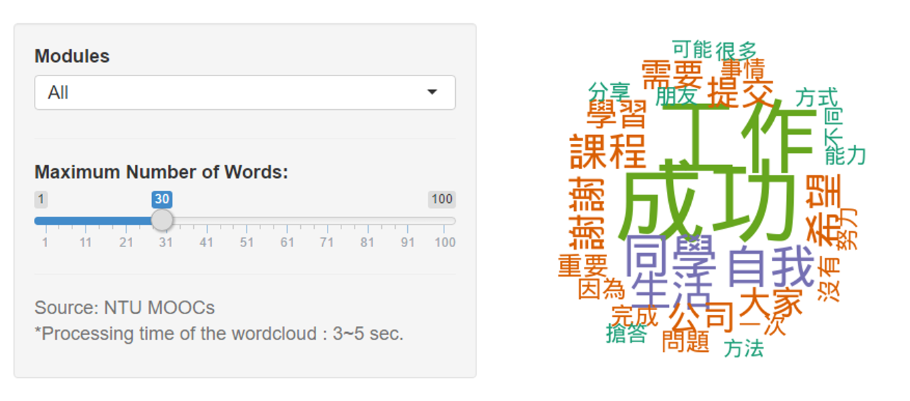
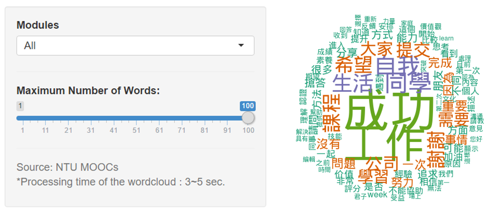
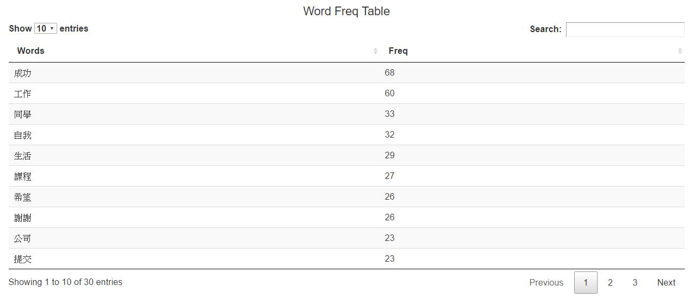
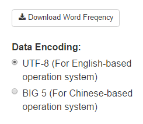
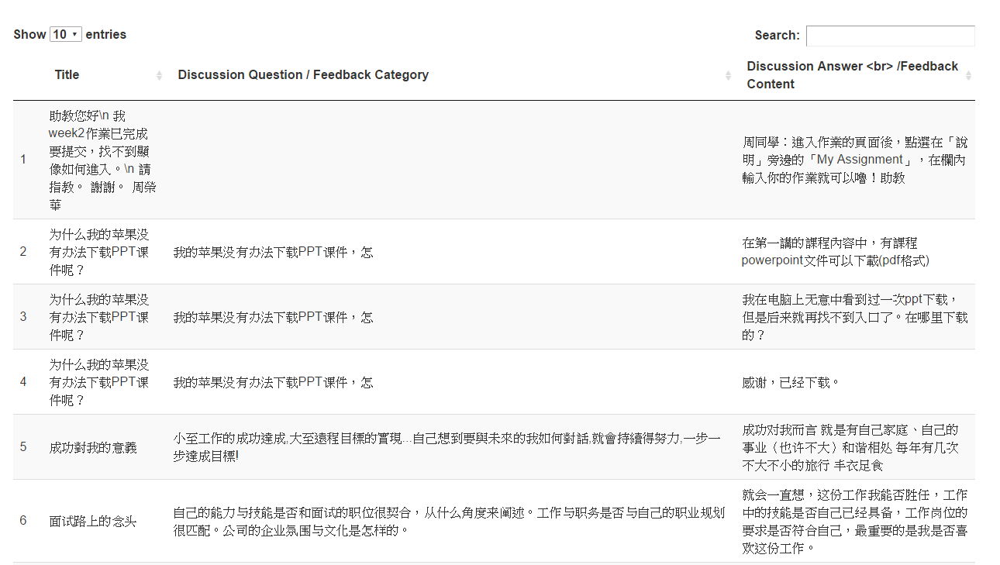
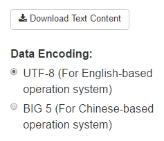

# 
Word Cloud 文字雲頁面簡介

## __主要功能__

* 呈現問題討論的關鍵字
* 互動式文字雲

  

## __問題討論文字雲__
 
### __1. 問題討論文字雲互動圖表__ 
* 圖表簡介
  + 體越大代表出現的次數越多
  + 老師們可藉此知道學生所關注議題的關鍵字
      

* Maximum Number of Words:
  + 此拉條可以選擇出現在文字雲中的字的數量 
  下圖顯示出拉條為 30 與 100 時出現的圖表，可發現拉條為 100 時，文字顯示數量明顯增
      
   
   
     

### __2. 文字出現頻率統計表__
* 圖表簡介
  + 由高到低顯示各關鍵字出現的頻率    
      
  
* 圖表下方提供 csv 檔的資料下載
  + utf8 大多為 Mac OS 作業系統所使用 
  + big5 的下載格式大多為 Windows 作業系統所使用 
  + 如果不太清楚建議兩種格式都下載，開啟沒有亂碼的為適用的格式
      
  

### __3. 原始討論問題資料表格__
* 使用者可以利用關鍵字搜尋自己所需的詳細資料

* 圖表上方提供 csv 檔的資料下載
  + utf8 大多為 Mac OS 作業系統所使用 
  + big5 的下載格式大多為 Windows 作業系統所使用 
  + 如果不太清楚建議兩種格式都下載，開啟沒有亂碼的為適用的格式

